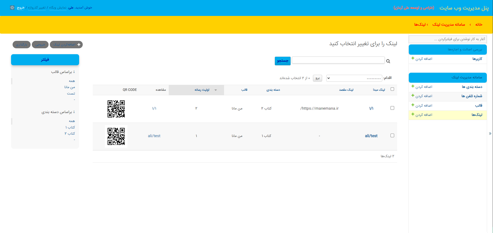

# پنل فارسی سازی جنگو



## توضیحات پروژه
در این پروژه فارسی سازی پنل ادمین جنگو انجام شده و به راحتی می توانید با اضافه کردن فایل css به پروژه خود، پنل ادمین جنگو را فارسی سازی کنید.

## نصب و راه‌اندازی
برای نصب و اجرای این پنل مدیریت، مراحل زیر را دنبال کنید:

1- **دریافت کد**: کد این پروژه را از مخزن گیت‌هاب خود دانلود کنید یا با استفاده از دستور زیر از گیت‌هاب کلون کنید.

```bash
git clone https://github.com/mraliarman/persian-djnago-admin
```

2- **اپدیت فایل setting.py**: نیاز است تا STATICFILES_DIRS  را در پروژه خود مشخص کنید:

```python
STATICFILES_DIRS = [
    BASE_DIR / "static",
]
```
مسیر انتخابی در این کد static می باشد.
سپس زبان پروژه را بر روی فارسی قرار دهید:

```python
LANGUAGE_CODE = 'fa-IR'
import locale
locale.setlocale(locale.LC_ALL, "fa_IR.UTF-8")
TIME_ZONE = 'Asia/Tehran'
USE_I18N = True
USE_TZ = True
```
3- **فایل rtl.css**: در مسیر زیر فایل rtl.css را جایگذاری کنید:

```bash
static/admin/css/rtl.css
```

4- **اجرای سرور**: سرور جنگو را اجرا کنید.

```bash
python manage.py runserver
```

5- **باز کردن پنل مدیریت**: به آدرس `http://localhost:8000/admin/` بروید و با استفاده از اطلاعات کاربر ادمین وارد شوید.


## تصاویر


## مشارکت
در صورتی که پیشنهادی برای بهبود پروژه دارید پذیرای شما هستم!

## مجوز
استفاده در تمامی پروژه ها بلامانع می باشد.

---
این پروژه توسط [علی آرمان](https://github.com/mraliarman) توسعه داده شده است.
